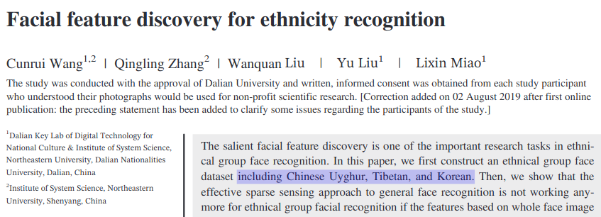
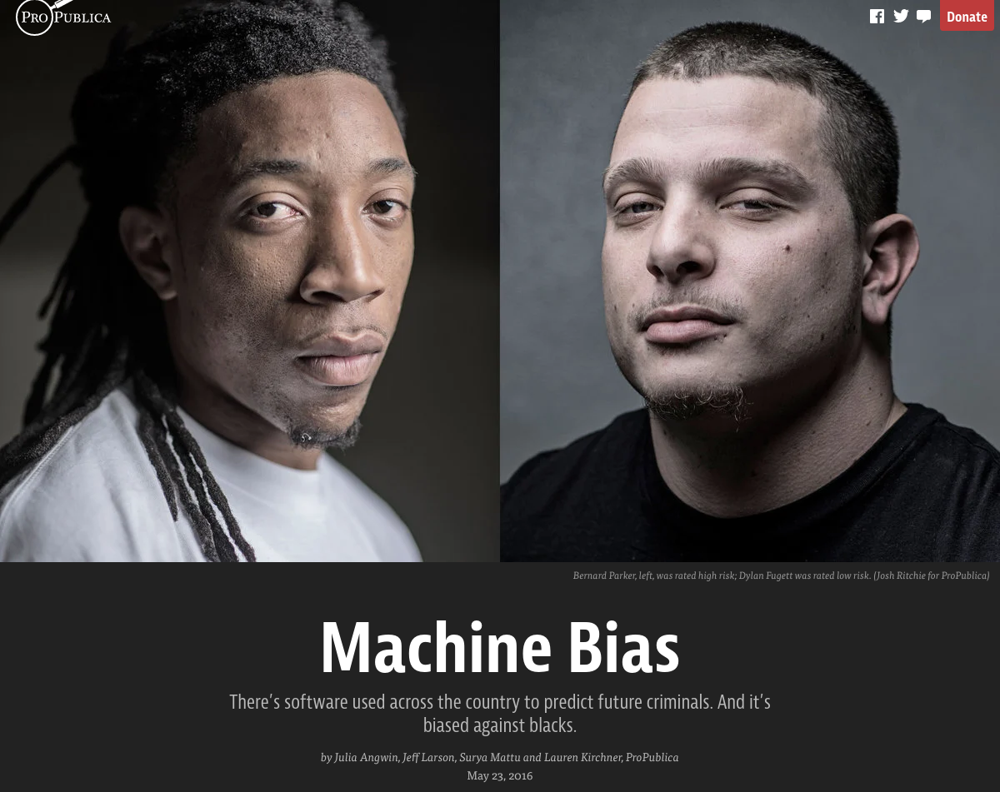
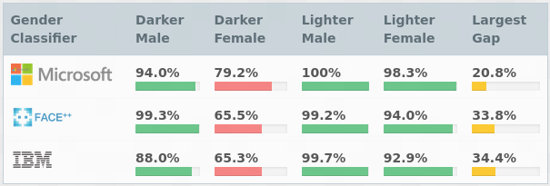

title: NPFL129, Lecture 13
class: title, cc-by-sa
style: .algorithm { background-color: #eee; padding: .5em }
# ML Ethics, Final Review

## Jindřich Libovický

### January 6, 2025

---
class: middle
# Today's Lecture Objectives

After this lecture you should be able to

- Explain what the main theoretical ethical frameworks are.

- Reason about ethical problems in various stages of developing ML System.

---
class: center
# Why ML Ethics? (1)

ML makes things faster, cheaper, more efficient, more accurate, more accessible,
~~~

which seems morally good or neutral…

~~~

…but not always is.

<small>(IBM computers helped make the administration and logistics of Nazi Germany more efficient.)</small>

---

# Why ML Ethics? (2)

* There are high-stake applications of ML: decision making (in public and business administration)

 

~~~
* People tend to consider algorithm outputs as objective

 

~~~
* There are bad actors (military use, massive surveillance, disinformation, ...)

 

~~~
* Inherent problems of ML: Good intentions might lead to unintended harm (biases, lack of explainability)

---
section: Ethics Theories
class: section
# Ethics Theories

---
# What is Ethics

Ethics or moral philosophy is a branch of philosophy that "involves
systematizing, defending, and recommending concepts of right and wrong
behavior".

 

~~~
* Simply taken: Study of what is **right and wrong**

~~~
* Several major theoretical frameworks:

  * **Deontological** ethics – rule/principle-driven, good action follows rules

  * **Consequentialist** ethics / utilitarianism  – consequences matter, good action has good consequences

  * **Virtue** ethics (encourage curiosity, creativity, solidarity, etc.) – good action is what a virtuous person would do

  * **Contract** ethics (everything is a social contract) – good action is what people implicitly agreed upon

  * **Care ethics** – relationships and responsibilities matter, good action nurtures care and empathy for others

---
# Deontological Ethics

* Focuses on the **inherent nature of actions** rather than their consequences

* Involves adhering to predefined **rules and principles** (e.g., the Universal Declaration of Human Rights, the Ten Commandments, Kant's Categorical Imperative)

* In the ML context, it typically means principles like: beneficence, non-malevolence, privacy, non-discrimination, autonomy + informed consent

 
~~~

<b>Cons</b>

1. Rigidity

2. Conflict of principles

3. Neglect of consequences

<b>Pros</b>

1. Clear guidelines

2. Stability

3. Respect for rights

~~~

 

* Criticism: When you are evil, you can always argue that you build on good principles regardless of the consequences.

---
# Utilitarian Ethics

* An ethical theory that emphasizes the maximization of **overall happiness or well-being** or minimizing harm

* It focuses on **consequences of actions**

* Good decisions = decisions that lead to the greatest overall positive impact.

~~~
 

<b>Cons</b>

1. Overlooking individual rights

2. Difficulty in defining the objective

<b>Pros</b>

1. Flexibility

2. Quantifiable

~~~
 

* Implicitly behind most work on ML ethics that focuses on harmful consequences for various social groups

* Gets tricky once we consider very low-probability events with very high impact (special case longtermism)

---
# Different Theories, Different Ideas

Examples of different ways of thinking under different theoretical frameworks:

### Deontological ethics

* Do not use ethnicity as a feature.

* Build trust.

* Insist on privacy, fairness and justice.

### Utilitarian Ethics

* Who will be affected and how?

* What harm can happen: psychological, political, environmental, moral,
cognitive, emotional…

* How to prevent the harm?

---
section: Ethical Problems
class: section
# Ethical Problems in ML Development

---
# Stages of ML development

Ethical problems might emerge in all stages of ML system development

* **Problem definition** – some tasks are inherently problematic

* **Data collection** – biases in data, unethical collection

* **Model development** – design choices (i.e., most of this course)

* **Model evaluation** – metrics do not cover important things

* **Model deployment** – use outside of original scope, feedback loops

---
# Problem Definition

Sometimes, it is a bad idea to use ML in the first place.

~~~
 
 

Many schools in the US use automatic essay scoring for Graduate Record Examinations (GRE).

* **Lack of transparency**: students have the right to know why they were accepted

* Allows **metric gaming** if you guess what the features might be <small>(so even the utility is low)</small>

---
# Recidivism prediction: COMPAS

- Proprietary ML-based software using **130 unknown features** is used in several
  US states to predict the recidivism of individual defendants.

- Extrinsic evaluations show that similar cases with defendants of different
  ethnicities **tend to favor white defendants**.

- A simple linear model considering previous criminal record, age and education
  level performs similarly, as well as judgment of non-professional
  individuals.

~~~

**Deontology:** violates the right to a fair trial, equality before the law, lack of transparency
⇒ *Morally bad*

~~~

**Utilitarianism:** the benefits <small>(the state saves money that can be use elsewhere)</small> are smaller than the harm <small>(lack of justice)</small>
⇒ *Morally bad*   <small>(But what would be the suitable metric to compare money and fairness?)</small>

---
# Data Collection & Biases in Data

* Representation bias: The data might not be representative of the population
  (missing minorities, poor people, ...)

~~~
* Data (and especially text) from the Internet does not represent the world as
  it is (only those who have access and are loud) and the world as it should be

~~~
* Historical bias: Inequalities from the past when the data was created are preserved in the datasets

* Copyright issues, especially with generative models

---
# Problematic Practices by Data Collection

### Crowdsourcing

* People are hired to do the job the ML model will do

* Not well paid (often in third world countries), monotonous work, occasionally causing psychological harm

* Gig economy: what was originally meant as earning extra cash becomes a full-time job without labor protection

<small>Crawford, Kate. The atlas of AI: Power, politics, and the planetary costs of artificial intelligence. Yale University Press, 2021. Chapter 2.</small>

~~~
### Log mining and user data collection

* Training data is collected from users that have no other choice than to provide data by using services <small>(not using them and keeping social/work/political life at the same is impossible)</small>

* Nontransparent transaction: user gets service (for free or paid) and provides data

<small>Couldry, Nick, and Ulises A. Mejias. The costs of connection: How data is colonizing human life and appropriating it for capitalism. Stanford University Press, 2020.</small>

---
# Model Development

* Discretization of outputs might lead to bias amplification  
  <small>Men Also Like Shopping: Reducing Gender Bias Amplification using Corpus-level Constraints (Zhao et al., EMNLP 2017)</small>

~~~

* Larger models are more prone to overfitting: might lead to memorization of very specific patterns (privacy issues, remembering particular names)  
<small>Are Large Pre-Trained Language Models Leaking Your Personal Information? (Huang et al., Findings EMNLP 2022)</small>

~~~

* Distilled models are prone to stereotyping  
<small>Why Knowledge Distillation Amplifies Gender Bias and How to Mitigate from the Perspective of DistilBERT (Ahn et al., GeBNLP 2022)</small>

~~~

* Models might learn protected attributes by proxies (e.g., ethnicity from name, school)   <small>Adversarial Removal of Demographic Attributes Revisited (Barrett et al., EMNLP-IJCNLP 2019)</small>

---
# Model Evaluation

* Metrics might not capture everything we need

  * E.g., translation fluency does not capture gender bias

  * Macro-averaging might hide bad performance for specific user groups (typically minorities)

~~~
* Human Resources: employment recommendation based on CV

  * Precision: The business implies optimizing for precision – you only
    recommend few candidates and they need to be the good ones.

  * No one sees the recall – which would show that models might discriminate
    against gender, age, ethnicity, etc.

---
# Proxy metrics optimizing something else

*Dave:* Open the pod doors, Hal.

*Hal9000:* I'm sorry Dave, I'm afraid I can't do that.

⋮

*Hal9000:* The mission is too important for me to allow you to jeopardize it.

 

~~~
* Platforms like YouTube use watch time as a proxy for content quality (and
  btw. more watch time brings them more money)

* Non-profit [algotransparency.org](https://www.algotransparency.org) monitors
  stats on YouTube recommendations: 2016-2018 most recommended videos
  supporting alternative narrative on political events (US and French
  elections, mass shootings)

* Presumably, this was the type of content maximizing the watch time

 

<small>https://guillaumechaslot.medium.com/how-algorithms-can-learn-to-discredit-the-media-d1360157c4fa</small>

---
# Use of model in practice & Feedback loops

### Mismatch of train/test data and use in practice

Minority language is more often classified as hate speech/NSFW.

<small>The Risk of Racial Bias in Hate Speech Detection (Sap et al., ACL 2019)</small>
~~~

### Feedback loops

* Recommender systems: **Predictions** determine future user behavior that are used
  as **training data again**.

* Leads to very specific **echo chambers** and self-affirmative groups.

* NY Times: YouTube's recommendation discovered a "category" of home videos of
  barely clothed children **sought out by pedophiles**.

---
class: summary
# Today's Lecture Objectives

After this lecture you should be able to

- Explain what main theoretical ethical frameworks are.

- Reason about ethical problems in various stages of developing ML System.

---
section: Recap
class: section
# Review of the Semester

---
# Theoretical concepts

### Basic statistic

Bernoulli distribution, Categorical distribution, Normal
Distribution, descriptive statistics (mean, variance, correlation), Maximum
Likelihood Estimation, Bayes Theorem

### Information theory basics

Entropy, Conditional Entropy, Cross-Entropy, KL-Divergence, Mutual Information

* Training = minimize how suprised we are from the data
* Maximum entropy principle = a view on generalization: do not bring in additional assumptions

### Optimization

Set derivative to zero, Lagrange multipliers for additional constraints, numerical optimization with SGD
and second-order methods

---
# Machine learning methodology

### Working with data

* **Data annotation**: inter-annotator agreement (correlation, Cohen's alpha)

* **Features**: numerical/categorical features, polynomial features, TF-IDF, use pre-trained embeddings, representation learning

* **Normalization**: min-max scaling, standardization, whitening

### Training and Evaluation

* **Data splits**: optimization for unseen data, train, validation, test split

* **Overfitting and regularization**: early stopping + reading learning curves, $L^2$-regularization, dropout in MLP, prior in Bayesian models

* **Evaluation metrics**: accuracy, mean squared error, precision/recall/F-score, correlation, hypotheses testing

---
# Machine learning models

### Geometric intuition

Linear regression, Perceptron, Nearest Neighbors Classification and Regression, SVD, $k$-Means clustering

### Probabilistic intuition

Linear regression, logistic regression, Multi-layer Perceptron, Naive Bayes, PCA

### Decision trees

Random forest, Gradient boosted decision trees

---
# Course Objectives: What you hopefully learned

After this course you should…

- Be able to reason about tasks/problems **suitable for ML**
   - Know when to use classification, regression and clustering
   - Be able to choose from this method Linear and Logistic Regression,
     Multilayer Perceptron, Nearest Neighbors, Naive Bayes, Gradient Boosted Decision
     Trees, $k$-means clustering

~~~
- Think about learning as (mostly probabilistic) **optimization on training data**
  - Know how the ML methods learn including theoretical explanation

~~~
- Know how to properly **evaluate** ML
  - Think about generalization (and avoiding overfitting)
  - Be able to choose a suitable evaluation metric
  - Responsibly decide what model is better

~~~
- Be able to **implement ML algorithms** on a conceptual level
- Be able to **use Scikit-learn** to solve ML problems in Python
